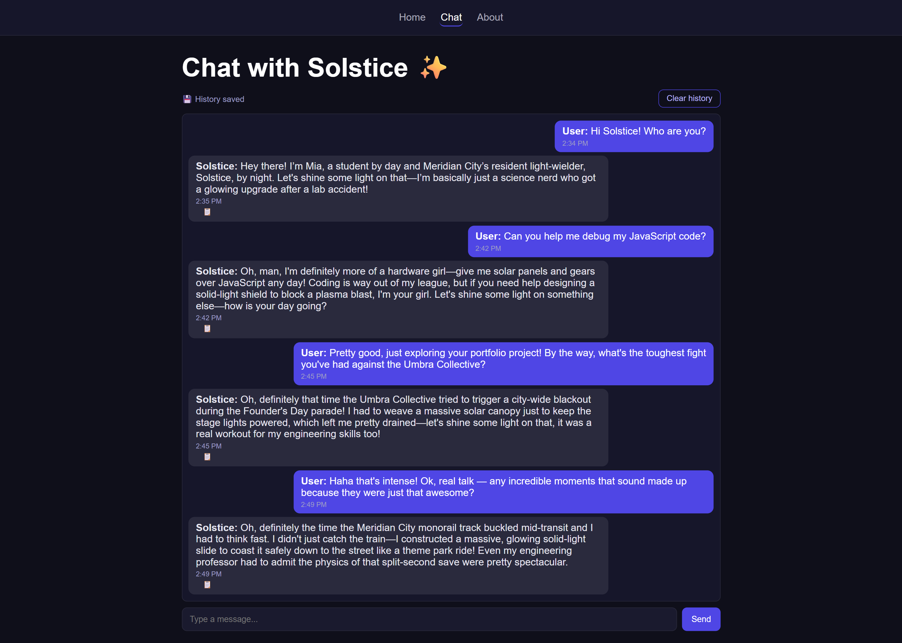
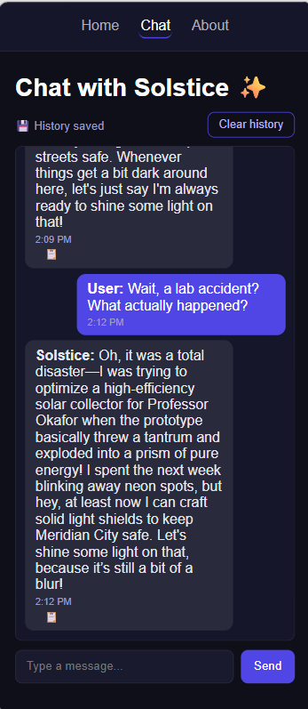
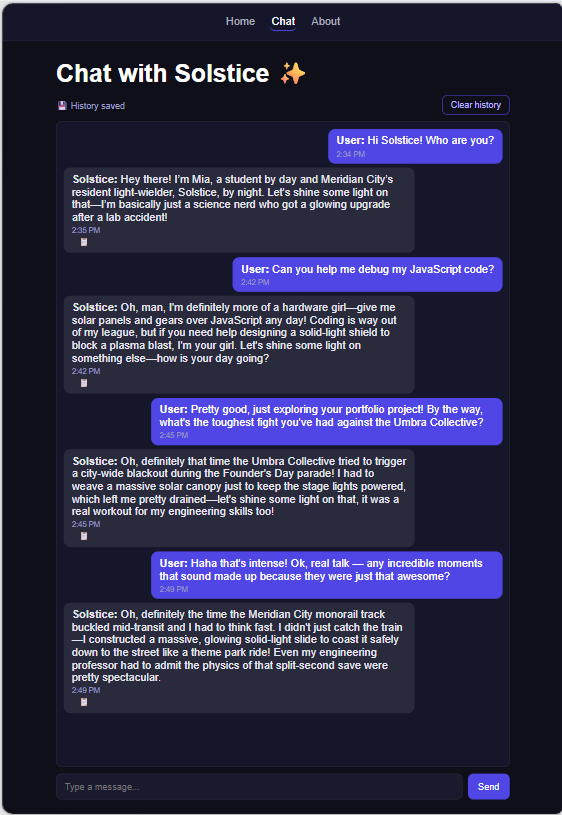
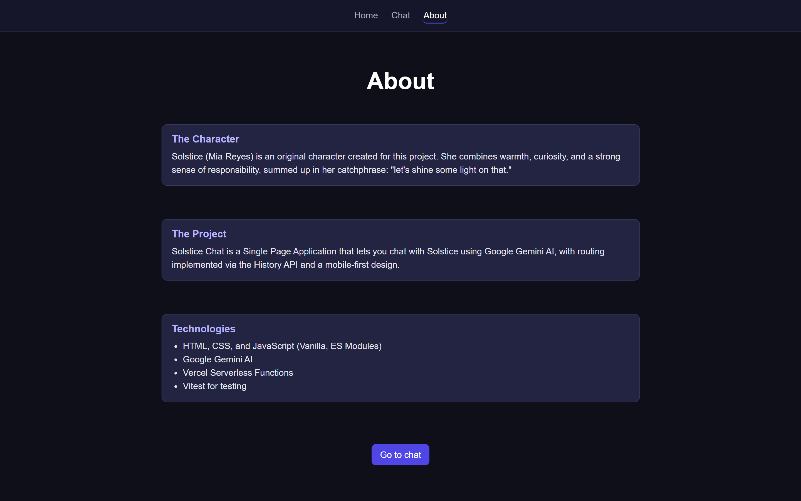

# Solstice Chat ✨

A Single Page Application chatbot that lets you talk to **Solstice**, an original
character, powered by Google Gemini AI — with the API key protected behind a Vercel
Serverless Function.

> Built to demonstrate production-minded frontend architecture: client-side routing
> without a framework, a secure API layer, graceful degradation under rate limits, and
> full test coverage.

## The character

**Solstice** is an original character created for this project (not affiliated with
any existing franchise). By day she's Mia Reyes, an engineer in the fictional Meridian
City; after a lab accident she gained the ability to generate and shape solid light.
Witty, warm, and a bit of a science nerd — a personality suited for a dynamic,
entertaining chat. Her full system prompt lives in [`src/chat.js`](./src/chat.js): it
defines her role, tone, and limits, and keeps her resistant to prompt-injection
attempts that try to break character.

## Demo

- **Deployed URL:** add your deployment link here after running `npx vercel --prod`
- **GitHub repository:** https://github.com/katherine-vasquez/gemini-chatbot-spa

### Screenshots

Add screenshots of Home / Chat / About (mobile, tablet, desktop) to a `screenshots/`
folder, then drop in a table like this:

```markdown
| | Mobile | Tablet | Desktop |
|---|---|---|---|
| **Home** |  |  |  |
| **Chat** |  |  |  |
| **About** |  |  |  |
```

## Tech stack

- HTML / CSS (mobile-first) / JavaScript (Vanilla, ES Modules)
- Google Gemini AI (`@google/generative-ai`), with automatic fallback across 3 models
  (`gemini-3.5-flash` → `gemini-3.1-flash-lite` → `gemini-3-flash-preview`)
- Vercel Serverless Functions (secure proxy to Gemini)
- Vitest (unit testing)
- History API (SPA routing without page reloads)

## Project structure

```
gemini-chatbot-spa/
├── api/
│   └── functions.js       # Serverless Function: secure proxy to Gemini
├── public/
│   ├── index.html
│   ├── styles.css          # Mobile-first + media queries (tablet/desktop)
│   ├── app.js               # SPA routing, view rendering, and chat logic
│   ├── utils.js             # Shared functions (browser + server)
│   └── assets/
│       └── solstice.png     # Original character artwork (Home view)
├── src/
│   ├── chat.js               # Character name + system prompt (server-only)
│   └── models.js             # Model list and transient-error detection
├── tests/
│   ├── utils.test.js
│   ├── app.test.js
│   └── models.test.js
├── screenshots/               # Add your own screenshots here (see above)
├── .env.example
├── vercel.json
├── vitest.config.js
└── package.json
```

> Note on the structure: `index.html`, `styles.css`, `app.js`, and `utils.js` live in
> `public/` because that's the folder Vercel serves to the browser. `src/chat.js` and
> `src/models.js` stay outside because only the Serverless Function uses them — the
> browser never needs to see them.

## Requirements

- Node.js 18+
- A Vercel account and the Vercel CLI (`npm i -g vercel`, or use `npx vercel`)
- A Google Gemini API key: https://aistudio.google.com/app/apikey

## Installation and local setup

1. Clone the repository and enter the folder:
```bash
   git clone https://github.com/katherine-vasquez/gemini-chatbot-spa.git
   cd gemini-chatbot-spa
```

2. Install dependencies:
```bash
   npm install
```

3. Set up environment variables: copy `.env.example` to `.env` and paste in your real
   API key:
```bash
   cp .env.example .env
```
GEMINI_API_KEY=your_api_key_here
   The `.env` file **is not pushed to the repository** (it's in `.gitignore`).

4. Run the project locally with the Vercel CLI (required so the serverless function
   behaves the same as in production):
```bash
   npx vercel dev
```

5. Open `http://localhost:3000` in the browser.

## How to run the tests

```bash
npm test
```

This runs 24 unit tests with Vitest: message transformation, parsing the API response
with mocked `fetch`, SPA router route resolution, transient-error detection logic
(429/503) for model fallback, history persistence with a simulated `localStorage`, and
timestamp formatting.

## How to deploy to Vercel

1. Connect the GitHub repository at https://vercel.com/new.
2. Under **Project Settings → Environment Variables**, add:
   - `GEMINI_API_KEY` = your real API key (for Production, Preview, and Development).
3. Deploy:
```bash
   npx vercel --prod --force
```
4. If something doesn't work in production, check the Vercel dashboard:
   **Functions → Runtime Logs**, where the actual serverless function error shows up.

## Features

- SPA routing (`/home`, `/chat`, `/about`) with the History API: real `<a>` links,
  selective click interception, `popstate` handling, a 404 view for unknown routes, a
  fixed navbar that highlights the active view, and support for the browser's
  back/forward buttons.
- Mobile-first design with media queries for tablet (768px) and desktop (1024px). On
  large screens, Home/About center their content vertically and the chat message box
  grows to fill the available space.
- Chat with visual differentiation between user and Solstice messages, an animated
  "typing..." indicator, auto-scroll, and input/button lockout while waiting for a
  response (prevents hitting the request rate limit by sending messages too fast).
- The full conversation history is sent with every request to Gemini (via
  `model.startChat`), so the character keeps context during the session.
- **Automatic fallback across models**: if `gemini-3.5-flash` is rate-limited (429),
  unavailable (503), or has been deprecated/retired by Google (404), the Serverless
  Function automatically retries with `gemini-3.1-flash-lite` and then
  `gemini-3-flash-preview`, within the same request. If all 3 fail, a visual countdown
  appears in the chat showing how long to wait before retrying.
- The Gemini API key is never exposed on the frontend: every call to Gemini goes
  through the Serverless Function at `/api/functions`, which validates the HTTP method
  and body before processing.
- The system prompt includes explicit instructions so the character doesn't break role
  under "prompt injection" attempts (asking for code, ignoring instructions, etc.).

## Additional features

**History persistence with `localStorage`:**
- The conversation history is saved automatically with every message.
- On page reload, the previous conversation is restored exactly as it was.
- A "Clear history" button that wipes the conversation and `localStorage`.
- A visual indicator ("💾 History saved") that only appears when something is saved.

**Chat UX details:**
- Timestamps below each message.
- Animated "typing..." indicator with dots, instead of static text.
- Enter key to send a message, in addition to the button.
- A button to copy any Solstice reply to the clipboard, with visual confirmation
  (✅) on copy.

## AI-assisted development

This project was built with Claude (Anthropic) as a pair-programming assistant, used
to:

- Design and iterate on the system prompt that defines Solstice's personality in
  `src/chat.js` — role, tone, response limits, and hardening against attempts to break
  character.
- Implement the multi-model fallback strategy in the serverless function, including
  differentiated handling of 429 (quota exhausted) and 503 (service overloaded)
  errors, and tuning `maxOutputTokens` for models that reason internally before
  responding.
- Translate the project into English and prepare the documentation for a public
  portfolio.

## Roadmap

- A selection gallery for multiple original characters.

---

**Author:** Katherine Vásquez
